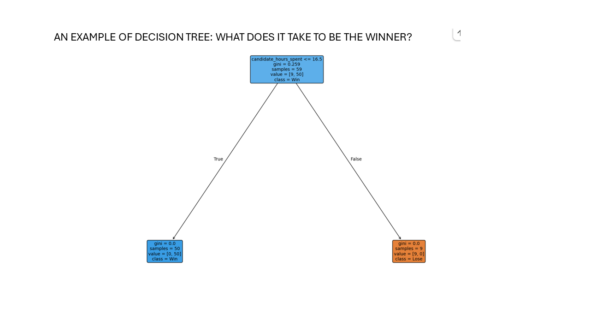

title: "Lab 3: Mayoral Mystery"
toc: false
---

This page is where you can iterate. Follow the lab instructions in the [readme.md](./README.md).

## Summary

In addition to this course, I am also taking a data mining course, and we just went through a decision tree methodology, so I used it for the Mayoral Mystery. I understand this exercise is based on a simulated data, but I still find it fascinating that the dilemma of the candidates in actual elections can be observed: the decision tree analysis shows that 1. if you spend lots of time in the district, you win, 2. for this particular party of 'blue' the voters in low to medium median income will vote for you, but not the voters in the high income district. But the question here is you did not spend a lot of time in the high income district because you thought they would not vote for you...but in reality NOT SPENDING ENOUGH TIME may be the real reason you lost!

<!-- Import Data -->
```js
const nyc = await FileAttachment("data/nyc.json").json();
const results = await FileAttachment("data/election_results.csv").csv({ typed: true });
const survey = await FileAttachment("data/survey_responses.csv").csv({ typed: true });
const events = await FileAttachment("data/campaign_events.csv").csv({ typed: true });
```

```js
// NYC geoJSON data
display(nyc)
// Campaign data (first 10 objects)
display(results.slice(0,10))
display(survey.slice(0,10))
display(events.slice(0,10))
```

// Observable Framework cell: Add 'win_or_lose' column
```js
const resultsWithWinOrLose = results.map(d => ({
  ...d,
  win_or_lose: d.votes_candidate > d.votes_opponent ? 1 : 0
}))
```

// Observable Framework cell: View table with new column
```js
Inputs.table(resultsWithWinOrLose)
```


// The nyc file is saved in data as a topoJSON instead of a geoJSON. Thats primarily for size reasons -- it saves us 3MB of data. For Plot to render it, we have to convert it back to its geoJSON feature collection. 


```js
const districts = topojson.feature(nyc, nyc.objects.districts)

// Optional: display districts for inspection
display(districts)
```


```js
Inputs.table(districts.features.map(d => d.properties))
```

// Merge 'resultsWithWinOrLose' csv data into 'districts' GeoJSON using boro_cd and BoroCD columns
```js
// Create a lookup for win_or_lose by boro_cd
const winOrLoseLookup = Object.fromEntries(resultsWithWinOrLose.map(d => [d.boro_cd, d.win_or_lose]))

// Merge win_or_lose into each district feature using BoroCD
// Winners and Losers by District

const mergedDistricts = {
  ...districts,
  features: districts.features.map(f => ({
    ...f,
    properties: {
      ...f.properties,
      win_or_lose: winOrLoseLookup[f.properties.BoroCD] ?? null
    }
  }))
}
```
```js
// District map colored by win_or_lose
Plot.plot({
  title: "WINNERS AND LOSERS BY DISTRICT: BLUE OUR CANDIDATES WON, RED WE LOST",
  projection: {
    domain: mergedDistricts,
    type: "mercator"
  },
  marks: [
    Plot.geo(mergedDistricts.features, {
      fill: d => d.properties.win_or_lose === 1 ? "#2563eb" : "#e11d48",
      fillOpacity: 0.7,
      stroke: "#222",
      strokeWidth: 1
    })
  ]
})
```

```js
// Display merged GeoJSON as JSON
mergedDistricts
```

### Decision Tree: Voting Conditions for Winners



<span style="color: blue; font-weight: bold;">THE ANALYSIS BELOW TAKES ADVANTAGE OF THE OUTCOME OF THE DECISION TREE</span>

```js
// Bar chart for win_or_lose counts
const winOrLoseCounts = [
  {label: "Win (1)", value: resultsWithWinOrLose.filter(d => d.win_or_lose === 1).length},
  {label: "Lose (0)", value: resultsWithWinOrLose.filter(d => d.win_or_lose === 0).length}
];

display(Plot.plot({
  title: "HOW DID WE DO? (BLUE COLOR MEANS WE WON)",
  marks: [
    Plot.barY(winOrLoseCounts, {
      x: "label",
      y: "value",
      fill: "label"
    })
  ],
  color: {
    domain: ["Win (1)", "Lose (0)"],
    range: ["#2563eb", "#e11d48"]
  },
  width: 300,
  height: 300
}))
```

```js
// Two side-by-side charts: win_or_lose counts filtered by candidate_hours_spent
const lowHoursData = resultsWithWinOrLose.filter(d => d.candidate_hours_spent <= 16.5);
const highHoursData = resultsWithWinOrLose.filter(d => d.candidate_hours_spent > 16.5);

const lowHoursCounts = [
  {label: "Win (1)", value: lowHoursData.filter(d => d.win_or_lose === 1).length},
  {label: "Lose (0)", value: lowHoursData.filter(d => d.win_or_lose === 0).length}
];

const highHoursCounts = [
  {label: "Win (1)", value: highHoursData.filter(d => d.win_or_lose === 1).length},
  {label: "Lose (0)", value: highHoursData.filter(d => d.win_or_lose === 0).length}
];
```

```js
// Chart 1: Hours <= 16.5
display(html`<h3>Hours ≤ 16.5</h3>`)
display(Plot.plot({
  title: "CANDIDATE SPENDING TIME IN DISTRICT COUNTS A LOT TOWARD WINNING",
  marks: [
    Plot.barY(lowHoursCounts, {
      x: "label",
      y: "value",
      fill: "label"
    })
  ],
  color: {
    domain: ["Win (1)", "Lose (0)"],
    range: ["#2563eb", "#e11d48"]
  },
  width: 300,
  height: 300
}))
```

```js
// Chart 2: Hours > 16.5
display(html`<h3>Hours > 16.5</h3>`)
display(Plot.plot({
  title: "IF YOU SPENT LESS THAN 16.5 HOURS CHANCE OF WINNING IN THE DISTRICT DIMINISHED DRAMATICALLY",
  marks: [
    Plot.barY(highHoursCounts, {
      x: "label",
      y: "value",
      fill: "label"
    })
  ],
  color: {
    domain: ["Win (1)", "Lose (0)"],
    range: ["#2563eb", "#e11d48"]
  },
  width: 300,
  height: 300
}))
```

```js
// Stacked bar chart: win_or_lose grouped by income_category
const winData = resultsWithWinOrLose.filter(d => d.win_or_lose === 1);
const loseData = resultsWithWinOrLose.filter(d => d.win_or_lose === 0);

// Count by income_category for wins
const winByIncome = d3.rollup(winData, v => v.length, d => d.income_category);
const winIncomeArray = Array.from(winByIncome, ([category, count]) => ({category, count}));

// Count by income_category for losses
const loseByIncome = d3.rollup(loseData, v => v.length, d => d.income_category);
const loseIncomeArray = Array.from(loseByIncome, ([category, count]) => ({category, count}));
```

```js
// Chart: Wins (1) stacked by income_category
display(html`<h3>Win (1) by Income Category</h3>`)
display(Plot.plot({
  title: "ALL LOW TO MIDDLE INCOME DISTRICT VOTED FOR YOUR PARTY (?)",
  marks: [
    Plot.barY(winIncomeArray, {
      x: "category",
      y: "count",
      fill: "category"
    })
  ],
  x: {label: "Income Category"},
  y: {label: "Count"},
  color: {legend: true},
  width: 400,
  height: 300
}))
```

```js
// Chart: Losses (0) stacked by income_category
display(html`<h3>Lose (0) by Income Category</h3>`)
display(Plot.plot({
  title: "THE HIGH-INCOME DISTRICT DID NOT VOTE FOR YOU--OR DID YOU SLACK OFF BY NOT VISITING THEM AS MUCH??",
  marks: [
    Plot.barY(loseIncomeArray, {
      x: "category",
      y: "count",
      fill: "#FF8C00"
    })
  ],
  x: {label: "Income Category"},
  y: {label: "Count"},
  width: 400,
  height: 300
}))
```